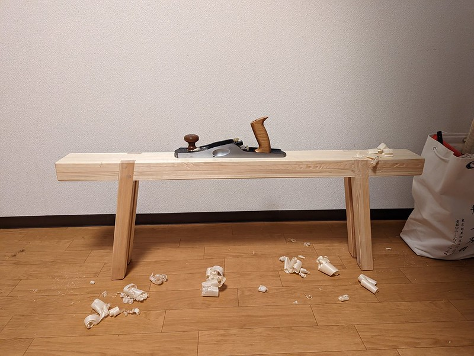
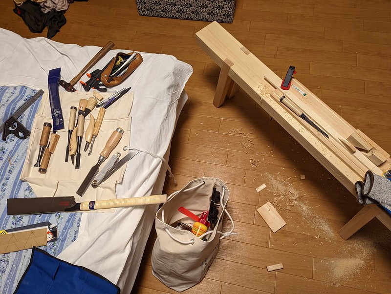
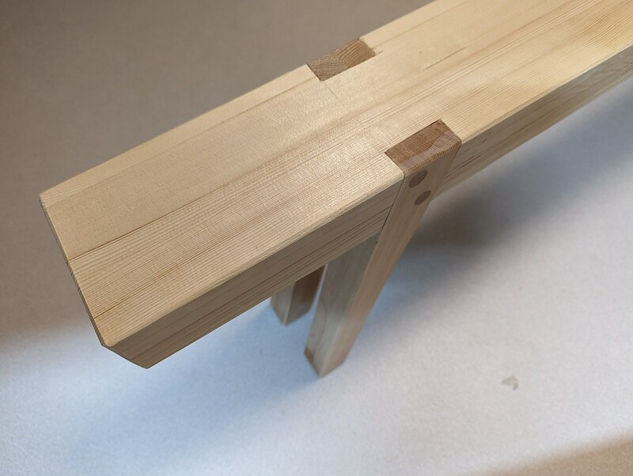

I learned carpentry when I was in high school, and had a great deal of fun
building furniture. I even got to build a few simple buildings, like a tractor
shed, a chicken coop and a network terminal shed for an underground fiber optic
line.  I learned in a big, dedicated workshop with heavy, industrial power
tools. Once I had to start paying my own rent, I completely lost access to one
of my favorite hobbies.

Since then, I've come to realize that the tradition in which I was taught
carpentry belongs to the twilight years of New England's small furniture
factories. The liminal space that exists between hobby, trade and industry is
an awkward one, and perhaps nowhere more than in carpentry (or "woodworking,"
as it is often called in the hobby context). The appearance of power
tools in the late 19th and early 20th century marks the transition of the
carpentry trade into an industry.

While a trade can be practiced as a hobby, it is difficult to justify
practicing an *industry* as a hobby. The problems that heavy machines were
invented to solve are not technical in nature, but financial. The purpose of
table saw is not to cut boards, but to replace some of the wages a business
owner pays their employees for cutting boards with interest payments and
capital depreciation. It is a machine for someone who has quite a lot of boards
to cut, and is motivated to sacrifice space, safety, air quality, peace and
quiet, and flexibility for raw speed.

I build things for fun, not for money. So, I have gradually begun to see that
the industrial tradition doesn't really make sense as a basis for carpentry as
a hobby. It makes more sense to look to carpentry as it was practiced as
a trade, before industrialization. Many people are also interested in
preserving carpentry traditions as cultural artifacts. I think this is
fantastic, and I am eager to learn from such people, but that isn't what I want
to do. I just want to make stuff. I'm happy to borrow tools, techniques and
concepts from any culture or point in history, as long as it is fun and it fits
in the space and time that I have.

I've built this little Roman-style workbench to fit in the corner of my
bedroom.  This is my first design, my first workbench build, and my first time
working with materials available from the local big box store, in Japan. The
outcome is very much a 1.0 experience. But, it seems to be serving its purpose,
which is to give me some basic work-holding features. I will probably make a new
bench soon, but I thought it would be a good idea to document this build as I add
features to it.

The bench is built from four 150mm by 15mm boards laminated into the top surface,
and four 180mm legs. I'm not sure what the leg joints should be called, exactly.
The legs are half-lapped with a 10 degree angle, and seated into angled dados and
pinned in place with dowels. The result is extremely rigid, and the slight angle
makes the bench very steady in the long direction. I usually sit on one end of it
when I'm using it, which keeps it stable in the lateral direction.

The idea was to make it narrow enough to fit under the bed, but unfortunately, the
bed in our faculty housing apartment is only 80mm off the floor. If I were going to
build it again, would have selected slightly wider material for top to make it more
comfortable to sit on, but this works well enough for now.
