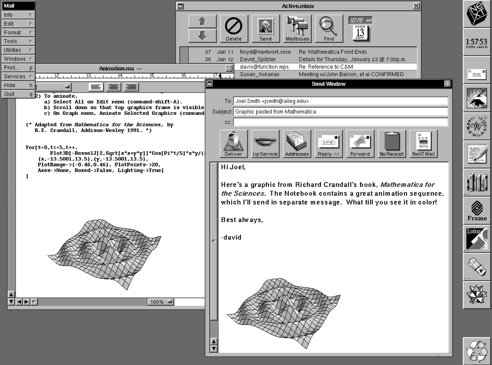

---
authors:
- ryneches
date: 2026-05-27
description: A little rededication of this dorky little blog after 23 years. Launched
  a new tool, mkprof, for running research blog using Obsidian and Jupyter to write
  articles.
tags:
- life
- science
- python
title: Back to the Future
---

# Back to the Future

{ .nb-photo }

I've had this blog for a long time. I set it up on October 1st, 2002. It's been 23 years, 7 months, and 18 days. That's more than half my life, and all of my life as an adult. Over the years, the internet has changed, and I gradually wrote less and less. Like everyone else, more of my attention has been absorbed by the big platforms. Like everyone else, I think I am worse for it.

For a while, some of those platforms actually did offer something of real value. A significant fraction of my scientific connections exist thanks to Twitter. I still find interesting research papers on Reddit. I even learn things from YouTube from time to time. Nevertheless, I can't help but feel that we're well beyond the point where the balance flipped. The platforms now take more than they give back.

One of the things I decided from the beginning is that I wasn't going to move it onto anyone else's infrastructure. It would have been much easier to move to Blogger, or WordPress, or Medium. I felt that it have been convenient, at least in the near term, but then again, I never had the sense that this thing exists to achieve a specific purpose. I have opinions, but I'm not a pundit. I'm glad you are here to read what I have to say, but growing an audience isn't something I've ever intended to try.

Like most people, a chunk of my life happens to be on the internet. In a sense, my little server is my home on the internet, and so the blog is some combination of my front porch and my university office. It's the [curtliage](https://en.wikipedia.org/wiki/Curtilage) of my personal and professional network. Nothing is for sale here, but I'm happy you came to visit.

While my mail server has been chugging along without complaints for more than twenty years -- with the same configuration files! -- the blog itself has been almost impossible to keep alive. Almost as soon as I have a shiny new tool up and running, the project maintainers abandon it, and it immediately begins to fall apart. This is the seventh or eighth complete rebuild. Self-hosting a blog is a lot like owning a British sports car. It's not something you do for practical reasons.

So, why? Well, it comes down to being able to say what I want to say. I suppose there is the potential for censorship, or some other kind of de-platforming to consider. Nothing I have to say is important enough, or frankly interesting enough, that I find myself strongly motivated by that particular concern. Censorship is something I mostly worry about on behalf of more interesting, more vulnerable people. What I mean is, if I want to tell you that the rate of growth of a population is proportional to its size, can I just say

$$
\frac{dP}{dt} = rP
$$

without having to suffer through some barbaric ritual of clicking little icons in a toolbar somewhere? If I want to explain to you how a piece of code works, can I just show it to you?

```python

while True :
    print( 'Please stop, I want to get out.' )

```

If I run the code, can I show you the results?

```
Please stop, I want to get out.
Please stop, I want to get out.
Please stop, I want to get out.
```

Jupyter Notebooks have been around for ages, and they do exactly this. They're the perfect tool for someone like me, whose research consists almost entirely of noodling around with messy data and half-broken software. I have hundreds of them cluttering my workstation. I want to be able to just take a notebook and stick it on my blog as an article.

In principle, this should be easy. Jupyter's `nbconvert` will render notebooks into Markdown or HTML, and there are lots of static site generators that will consume the output. The problem is that this only gets you about 90% of the way there. Markdown comes in different flavors, and so cleanup steps are required. Embedded media like plots have end up in silly places that don't follow the site generator's conventions, and there's no real namespace safety for media filenames preventing accidental overwrites. Once you've fixed that, you have to fix all the links in the document, and while you're doing that, you have keep in mind where all the files are going to land when the site is built. There is also the chore of adding [article metadata to the notebook](https://pretty-jupyter.readthedocs.io/en/latest/metadata.html) in a raw-format cell, which technically intriguing the first time you do it, and an infuriating chore on every subsequent occasion.

I made a tool called [mkprof](https://mkprof.vort.org/) that automates most of this stuff. I made it for myself, with the intention of using it to post articles and notebooks without undue suffering. I thought perhaps other people might want something like this, and so it's available as a [Python package on PyPi](https://pypi.org/project/mkprof/).

So, yeah. I'm going to try to spend more time making things, and less time consuming whatever is on the platforms. If you do the same, maybe I'll drop by your place and check out what you've decided to share.

Cheers.
