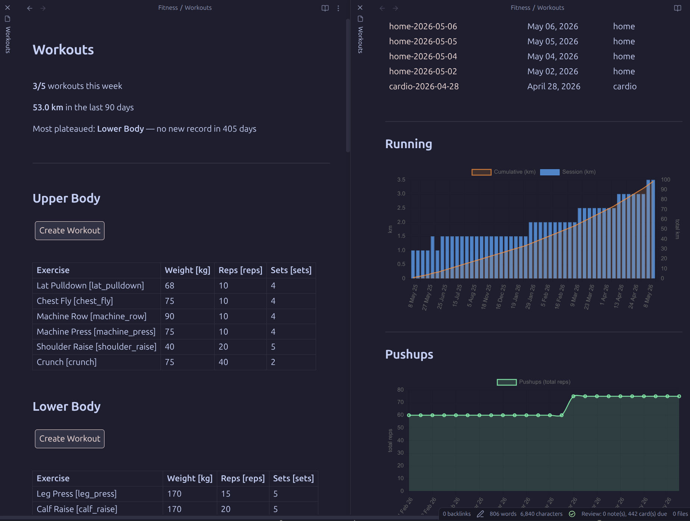
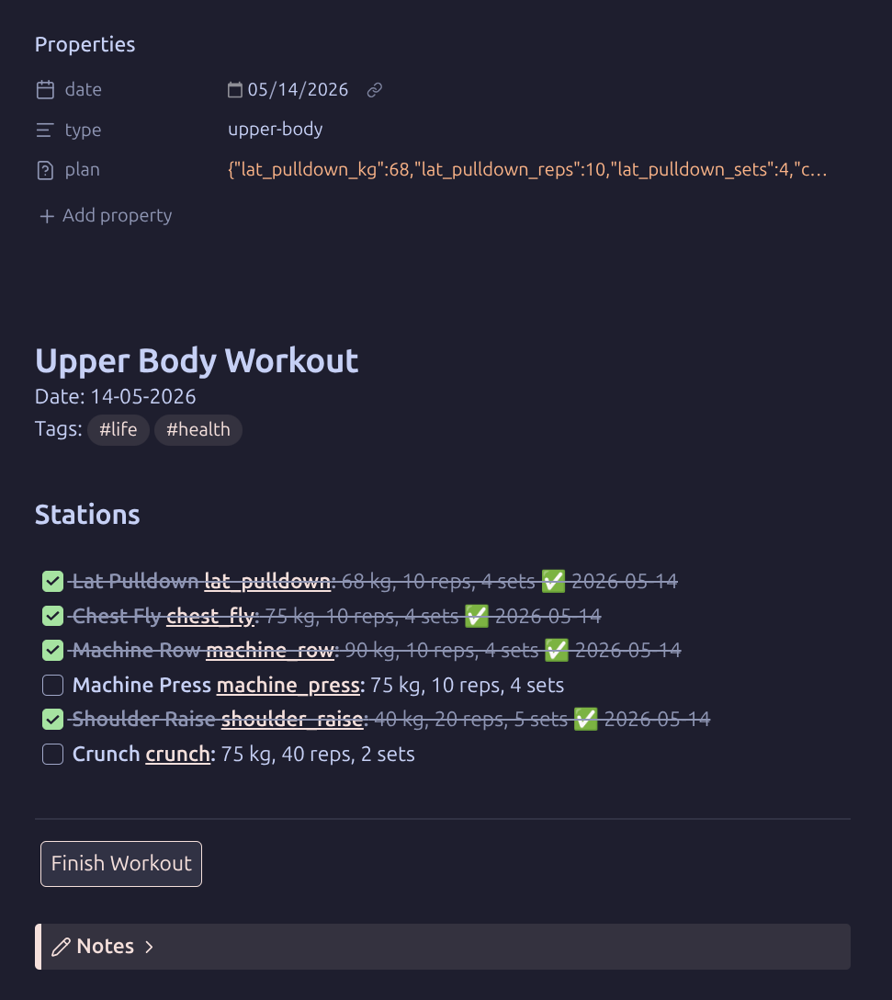
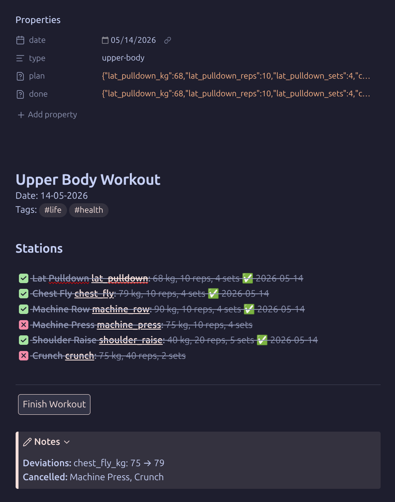

---
authors:
- ryneches
date: 2026-05-28
description: I accidentally wrote a fitness tracker for Obsidian. It's not a plugin
  or anything, just some Templater and DataviewJS code and a single hub note to act
  as a dashboard. It grew organically over a couple of years, and decided to clean
  it up and share it.
tags:
- life
- fitness
- obsidian
- code
title: A fitness tracker for Obsidian
---

# A fitness tracker for Obsidian

I don't really enjoy the gym. I suppose that perhaps my fascination with biology ends at the cell membrane, because the jargon of muscle groups and their biomechanics to makes my eyes glaze over and my brain scramble for the exits. Fortunately for me, my wife, who took a minor in anatomy as part of her biology degree and actually enjoys the gym, was kind enough to design a routine I can follow without having to think about it too hard. She wrote down the location of the machine, the settings, and the goofy motions I'm supposed to perform with it. I just do the thing, and when it starts to feel easy, I cross out the number in front of "kilograms" and write in the next bigger number on the machine. I don't think I'd have been able to get started without her simplifying it for me! Her gym routine notes looks like the maintenance schedule of a high performance military aircraft to me.

Anyway, eventually the list she wrote for me turned into [Obsidian](https://obsidian.md) note, and usual thing started to happen. It became a checklist. Then I started automating adding new checkboxes for each workout. The automation started to get more elaborate. After two years of embroidery, it's basically grown into a fitness tracker app. I decided to tidy it up and share it.

So, this is a workout tracking system for built around a single hub note. I designed this with these ideas in mind :

- I don't want to think about anything while I'm at the gym. I just want to check off tasks.
- I don't want to spend a lot of planing. I just want to put the numbers into a table.
- When I make charts and stats, I want them to update automatically when I finish a workout.

So, it my tracker works like this : Press a button to create a workout note pre-filled from your current targets, check off exercises as you go, press a button to finish. The scripts create new workouts based on whatever is in the workout table and writes structured frontmatter into each workout note automatically so the history is queryable with Dataview and Charts.

You can get code from the [Github repo](https://github.com/ryneches/obsidian_fitness_tracker).

It's automated enough to make routine days easy, but flexible enough not to make struggle days worse.

{ .nb-photo }
*The hub note — session count, running total, and plateau alert at the top; one button per workout type; progress charts below.*

## Plugins

| Plugin | Author | Purpose |
| --------------------------------------------------------------- | -------------------- | --------------------------------------------------------- |
| [Dataview](https://github.com/blacksmithgu/obsidian-dataview) | blacksmithgu | Querying workout history; rendering charts via DataviewJS |
| [Templater](https://github.com/SilentVoid13/Templater) | SilentVoid13 | Running the create/finish scripts |
| [Buttons](https://github.com/shabegom/buttons) | shabegom | One-tap workout creation from the hub note |
| [Tasks](https://github.com/obsidian-tasks-group/obsidian-tasks) | obsidian-tasks-group | Checkbox state tracking and completion timestamps |
| [Charts](https://github.com/phibr0/obsidian-charts) | phibr0 | Rendering progress charts |

All are available in the Obsidian Community Plugins browser.

### Dataview

- **Enable JavaScript Queries** — on (required for DataviewJS blocks and charts)
- **Enable Inline Queries** — optional, not used by this system

### Templater

- **Template folder location** — set to your `Templates/` folder
- **Script files folder location** — set to `Templates/Scripts/`
- **Trigger Templater on new file creation** — **on** (this is what fires the create script when the Buttons plugin creates a new note)

### Buttons

No special settings required beyond installation.

### Tasks

No special settings required. The system uses `[x]` / `[-]` checkbox states and the `✅ YYYY-MM-DD` completion stamp that Tasks writes automatically.

### Charts

No special settings required beyond installation.

## Installation

Fetch the code from the [Github repo](https://github.com/ryneches/obsidian_fitness_tracker). You can clone it directly into your vault directory, and it should just work.

1. Copy the following into your vault, preserving the folder structure :

```
Fitness/
  Workouts.md
  Workouts/          ← workout notes are created here automatically
Templates/
  Create Upper Body Workout.md
  Create Lower Body Workout.md
  Create Cardio Workout.md
  Create Home Workout.md
  Scripts/
    createWorkout.js
    finishWorkout.js
```

2. Install and enable all five plugins listed above.
1. In Templater settings, set **Template folder** to `Templates/` and **Script files folder** to `Templates/Scripts/`.
1. Enable **Trigger Templater on new file creation** in Templater settings.
1. Open `Fitness/Workouts.md`. The three bold summary lines at the top will populate once you have workout notes in the folder.

## Designing workouts

All workout types are defined in `Workouts.md`. Each type is a `##` section containing a table of exercises. Add a row to the table in the relevant section. The column header format is :

```
| Exercise | Weight [kg] | Reps [reps] | Sets [sets] |
```

The bracketed annotation (`[kg]`, `[reps]`, etc.) defines the frontmatter key suffix that will be written for that column. The first column is always the exercise name, and its bracketed annotation is the exercise key used throughout the system:

```
| Lat Pulldown [lat_pulldown] | 68 | 10 | 4 |
```

Blank cells produce no frontmatter key, which is how optional columns work (e.g. Planks has a duration but no reps).

To add a new workout type :

1. Add a new `##` section to `Workouts.md` with a table following the format above.

1. Create a one-line shim template in `Templates/` named `Create <Type> Workout.md` :

```
<%%* tR += await tp.user.createWorkout(tp, 'Type Name') -%%>
```

where `'Type Name'` exactly matches the `##` heading in `Workouts.md`.

3. Add a button to the new section in `Workouts.md`:

````
```button
name Create Workout
type note(Fitness/Workouts/<type-name>) template
action Create <Type> Workout
templater true
```
````

The filename prefix is derived automatically from the section heading (`'Lower Body'` → `lower-body`). `createWorkout.js` renames the placeholder file to the correct dated name (e.g. `lower-body-2026-05-14.md`) before writing any content, so no date expression is needed in the button.

### Columns and units

The unit in each column header becomes part of the frontmatter key :

| Header | Key suffix | Example key |
|--------|-----------|-------------|
| `Weight [kg]` | `_kg` | `lat_pulldown_kg` |
| `Reps [reps]` | `_reps` | `lat_pulldown_reps` |
| `Sets [sets]` | `_sets` | `lat_pulldown_sets` |
| `Distance [km]` | `_km` | `running_km` |
| `Speed [km/h]` | `_km_h` | `running_km_h` |
| `Duration [s]` | `_s` | `planks_s` |

Slashes in units are converted to underscores (`km/h` → `km_h`).

## How to do a workout

1. Open `Fitness/Workouts.md` and press the **Create Workout** button for the type you want. A new dated note is created in `Fitness/Workouts/` and opened automatically.

{ .nb-photo }
*A freshly created workout note — each station pre-filled from your current targets in `Workouts.md`.*

2. Work through your exercises. Each station is a checkbox pre-filled with your target values :

   ```
   - [ ] **Lat Pulldown [lat_pulldown]:** 68 kg, 10 reps, 4 sets
   ```

   Check the box when done. If you deviated from the target (different weight, fewer sets), edit the values on the line before checking.

1. When finished, press **Finish Workout**. The script:

   - Reads every checked item and writes the actual values to `done:` frontmatter
   - Marks any unchecked items as `[-]` (cancelled)
   - Expands the Notes callout and records any deviations from `plan:` or cancelled exercises

The `plan:` frontmatter (written on creation) records what you intended. The `done:` frontmatter (written on finish) records what you actually did. Differences between the two are deviations.

{ .nb-photo }
*After pressing Finish Workout — checked items are written to `done:` frontmatter, cancelled items marked `[-]`, and any deviations summarized in the Notes callout.*

## Frontmatter structure

The metadata is created automatically, so you don't have to actually do anything for this to work. Each workout note has this structure :

```yaml
---
date: 2026-05-14
type: upper-body
plan:
  lat_pulldown_kg: 68
  lat_pulldown_reps: 10
  lat_pulldown_sets: 4
  chest_fly_kg: 75
  ...
done:
  lat_pulldown_kg: 70      # you went heavier
  lat_pulldown_reps: 10
  lat_pulldown_sets: 4
  chest_fly_kg: 75
  ...                      # cancelled exercises are absent from done:
---
```

- `type` is the kebab-case prefix derived from the section heading
- `plan` is set on creation; `done` is set on finish
- A key present in `plan` but absent from `done` means that exercise was cancelled
- A value in `done` that differs from `plan` is a deviation

## Querying data with DataviewJS

Because each workout has its data encoded in the YAML frontmatter, it is pretty easy to query using DatavewJS. The basic pattern for querying looks like this :

```javascript
const pages = dv.pages('"Fitness"')          // all notes in Fitness/ and subfolders (recursive)
    .where(p => p.type === "upper-body" && p.done)
    .sort(p => p.date, "asc")
    .array();
```

Nested YAML objects (`plan:`, `done:`) are accessible as plain properties :

```javascript
p.done.lat_pulldown_kg   // number
p.plan.lat_pulldown_sets // number
```

### Some common patterns

**All values for one exercise over time :**

```javascript
pages.map(p => ({ date: p.date, kg: p.done.lat_pulldown_kg }))
```

**All-time PR for a field :**

```javascript
Math.max(...pages.map(p => p.done.lat_pulldown_kg ?? 0))
```

**Total volume (reps × sets) per session :**

```javascript
pages.map(p => Number(p.done.pushups_reps) * Number(p.done.pushups_sets))
```

**Cumulative total :**

```javascript
let cum = 0;
const cumulative = values.map(v => (cum += v));
```

**Sessions in the last N days :**

```javascript
const cutoff = dv.date("today").minus({ days: 90 });
dv.pages('"Fitness"').where(p => p.date >= cutoff)
```

### Rendering a chart

To render a chart, pass a [Chart.js](https://www.chartjs.org/docs/) config object to `window.renderChart()` :

```javascript
window.renderChart({
    type: "line",
    data: {
        labels: pages.map(p => p.date.toFormat("d MMM yy")),
        datasets: [{
            label: "Distance (km)",
            data: pages.map(p => p.done.running_km),
            borderColor: "rgba(37, 99, 235, 0.9)",
            backgroundColor: "rgba(37, 99, 235, 0.15)",
            fill: true,
            tension: 0.3,
            pointRadius: 3,
            borderWidth: 2
        }]
    },
    options: {
        scales: {
            y: { min: 0, title: { display: true, text: "km" } }
        }
    }
}, this.container);
```

**Tips :**

- Use `rgba()` for colors — CSS variable approaches are unreliable in DataviewJS context
- Check `document.body.classList.contains("theme-dark")` to pick light/dark variants
- For dual-axis charts, assign `yAxisID: "y"` and `yAxisID: "y1"` to datasets and define both axes in `options.scales`
- Set `order: 1` on the dataset you want rendered on top (lower = on top)
- `pointRadius: 0` on lines with many data points avoids visual clutter
- `autoSkip: true` with `maxTicksLimit` on the x-axis prevents label crowding
