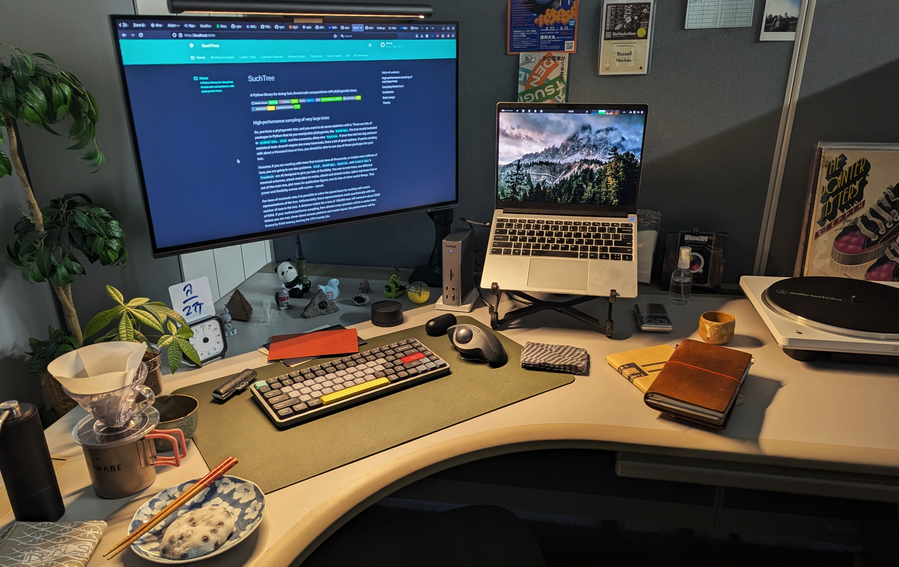

{ .nb-photo }

Hi! I'm Russell.

I'm a microbiologist who uses graph theory and machine learning to study the
relationships that bacteria and archaea form with their host organisms, and
lately [giant viruses](https://en.wikipedia.org/wiki/Giant_virus) and their
hosts. Or, I'm a computer scientist who builds software that uses concepts from
evolution to extract knowledge about ecology from large datasets. Or, I'm
a data scientist who uses Python to explore biological systems. Or, I'm
a physicist that went rouge and defected to the squishy side of science. Take
your pick.

I am an assistant professor at [Kyoto University](https://www.kyoto-u.ac.jp/)
[Institue of Chemical Research](https://www.kuicr.kyoto-u.ac.jp/) working with
[Motomu Matsui](https://sites.google.com/site/motomumatsui/)'s group.

<!-- RECENT_POSTS -->

### Other places you can find me

🪴 Blog : [Vort.org](https://vort.org) 
🐙 Github : [github.com/ryneches](https://github.com/ryneches) 
🦣 Mastodon : <a rel="me" href="https://ecoevo.social/@ryneches">@ryneches@ecoevo.social</a> 
📜 Scholar : [ryneches](https://scholar.google.com/citations?user=Xis0TMUAAAAJ&hl=en) 
✒️  ORCID : [0000-0002-2055-8381](https://orcid.org/0000-0002-2055-8381) 
🦋 Bluesky : [@ryneches.bsky.social](https://ryneches.bsky.social) 
📸 Flickr : [https://www.flickr.com/photos/rneches/](https://www.flickr.com/photos/rneches/) 
⚗️  Laboratory : [京都府宇治市五ヶ庄 京都大学 化学研究所 バイオインフォマティクスセンター](https://www.bic.kyoto-u.ac.jp/) 

